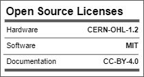
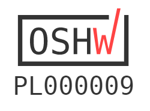
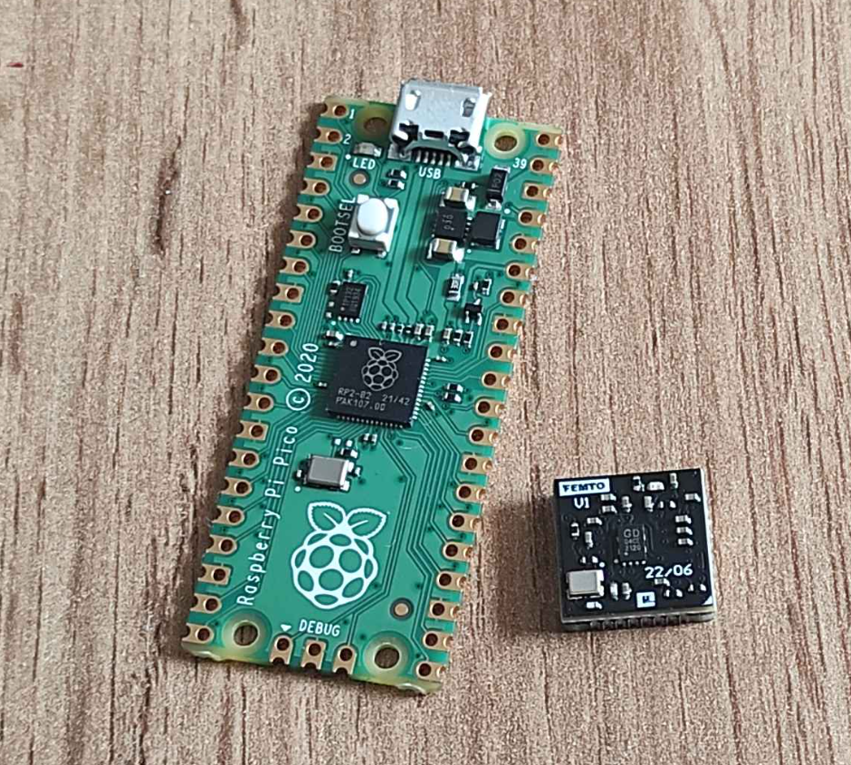
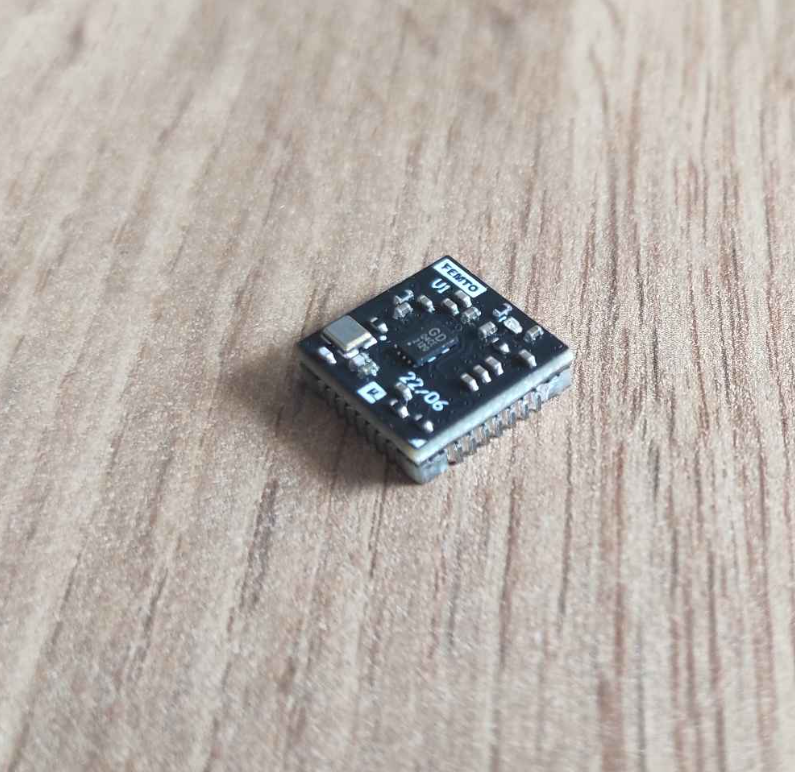
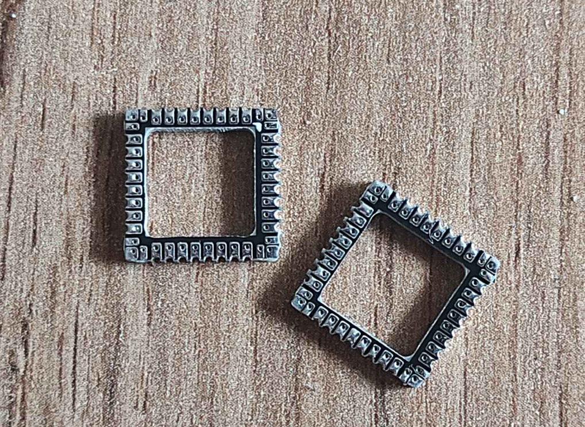
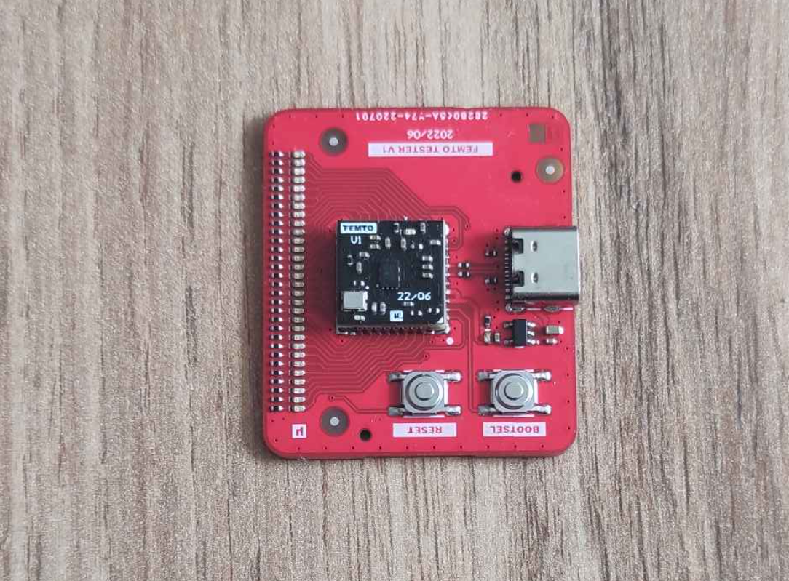

# Femto - RP2040 12x12mm PCB module

## Description

Femto is a ultra compact Raspberry Pi RP2040 module, which has features, as following:
- small footprint 12x12mm,
- all 30 GPIO pins connected,
- stamp form factor,
- 4-layer PCB board,
- onboard: QSPI Flash (USON8 package), 12MHz oscillator, PWR LED,
- fully open source project (OSHW).

Here you can find:
- \Photos: a few pictures of the assembled PCB boards
- \Python: simple script do test Femto module using Femto Tester board (use Thonny IDE)
- \manufacturing_files: all the production files for ordering PCB and assembly at JLCPCB (Gerber files, Pick & Place, BOM, etc.)
- \source_files: source files in Kicad and Altium Designer format

The main goal and reason to create this project was attempt to design as smallest as possible, and fully functional RP2040 module. Please note, that RP2040 MCU nas 7x7mm package, and Femto module has only a bit more, 12x12mm. In comparision, closer competitiors, such as Raspberry Pi Pico or RP2040 Stamp (Solder Party) have appropriately 51x21mm and 25x25mm.

The project consists of 3 parts:
- Module (mainboard)has now officially been certified as open source hardware by the Open Source Hardware Association
- frame (solder frame)
- tester (testbench, only for functional verification)

## License

Project published as Open Source Hardware (OSHW) under CERN OHL v1.2 (Open Hardware Licence).

Project has been certified as Open Source Hardware by the Open Source Hardware Association (OSHWA)
UID is: PL000009

https://certification.oshwa.org/pl000009.html

## Press release:

[hackster.io](http://hackster.io/news/mirek-folejewski-s-femto-module-is-a-full-feature-raspberry-pi-rp2040-in-the-smallest-footprint-yet-d75727c4adbf.amp)

[cnx-software.com](https://cnx-software.com/2022/08/22/femto-tiny-raspberry-pi-rp2040-module/)

[blingeach.com](https://blingeach.com/mirek-folejewskis-femto-module-is-a-full-function-raspberry-pi-rp2040-within-the-smallest-footprint-but/)

[tecnohub.org](https://tecnohub.org/2022/08/a-full-featured-raspberry-pi-rp2040-in.html?m=1)

[theperfectech.com](https://theperfectech.com/mirek-folejewskis-femto-module-is-a-full-characteristic-raspberry-pi-rp2040-within-the-smallest-footprint-but/)

[hackaday.io](https://hackaday.io/project/186871-femto-module-v1)

## Photos

Raspberry Pico and Femto Module v1:

Femto Module:

Femto Frame:

Femto Tester:

